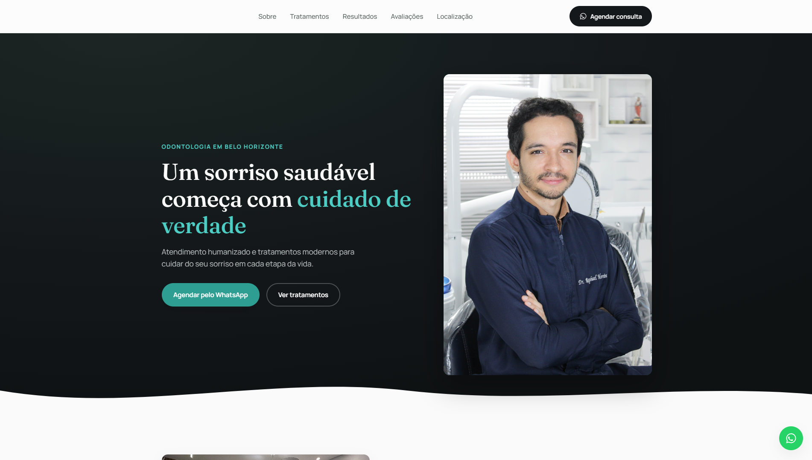

# Dr. Raphael Moreira — Site Institucional
 
Site institucional desenvolvido para o **Dr. Raphael Moreira**, cirurgião-dentista em Belo Horizonte (MG), com foco em apresentação profissional e conversão de visitantes em agendamentos via WhatsApp.
 
🔗 **Site no ar:** [dr-raphael-moreira.vercel.app](https://dr-raphael-moreira.vercel.app/)
 

 
---
 
## ✨ Funcionalidades
 
- **Design responsivo** — construído mobile-first, testado em diferentes tamanhos de tela
- **Slider interativo de Antes/Depois** — comparação por arraste (mouse e touch), com suporte a teclado para acessibilidade
- **Carrossel de fotos** — galeria do consultório com navegação por setas e indicadores
- **Avaliações do Google integradas** — via widget Elfsight, atualizado automaticamente
- **Mapa incorporado** — localização exata do consultório via Google Maps embed
- **Agendamento via WhatsApp** — botões com mensagem pré-preenchida, incluindo botão flutuante fixo
- **Animações leves ao rolar** — fade-in com `IntersectionObserver`, sem impacto de performance
- **Acessibilidade** — skip-link, `aria-labels`, contraste de cor revisado, navegação por teclado
## 🛠️ Tecnologias
 
- **HTML5** semântico
- **CSS3** puro (custom properties, Grid, Flexbox, `clip-path`)
- **JavaScript** vanilla (sem frameworks ou dependências)
- **Vercel** para deploy e hospedagem
- **Elfsight** para o widget de avaliações do Google
Projeto construído sem frameworks ou bibliotecas externas, priorizando performance e tempo de carregamento.
 
## 📁 Estrutura do projeto
 
```
site-dr-raphael-moreira/
├── index.html
├── css/
│   └── style.css
├── js/
│   └── main.js
├── assets/
│   ├── images/
│   └── icons/
└── README.md
```
 
## 🚀 Rodando localmente
 
Como é um projeto estático (sem build step), basta abrir o `index.html` direto no navegador, ou servir localmente:
 
```bash
# Clone o repositório
git clone https://github.com/thiagosilva25/site-dr-raphael-moreira.git
cd site-dr-raphael-moreira
 
# Sirva com qualquer servidor local, por exemplo:
python3 -m http.server 8080
# ou
npx serve
```
 
## 📌 Destaque técnico: Slider de Antes/Depois
 
O componente de comparação foi construído do zero em JavaScript puro — sem bibliotecas de terceiros — captando eventos de mouse e touch manualmente para garantir uma experiência de arraste consistente em qualquer dispositivo:
 
```js
const getPercentFromEvent = (e) => {
  const rect = slider.getBoundingClientRect();
  const clientX = e.touches ? e.touches[0].clientX : e.clientX;
  return ((clientX - rect.left) / rect.width) * 100;
};
```
 
O corte visual entre as duas imagens é feito com `clip-path`, atualizado em tempo real conforme o usuário arrasta.
 
## 👤 Autor
 
Desenvolvido por [Thiago Rocha da Silva](https://github.com/thiagosilva25).
 
## 📄 Licença
 
Projeto de uso exclusivo do Dr. Raphael Moreira. Código disponibilizado publicamente apenas para fins de portfólio.